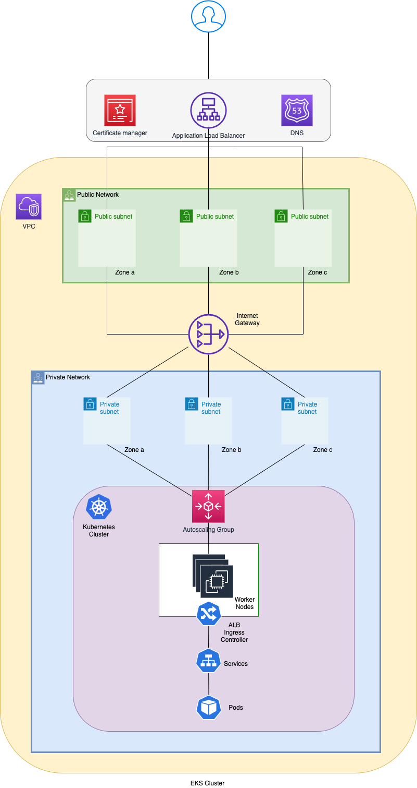
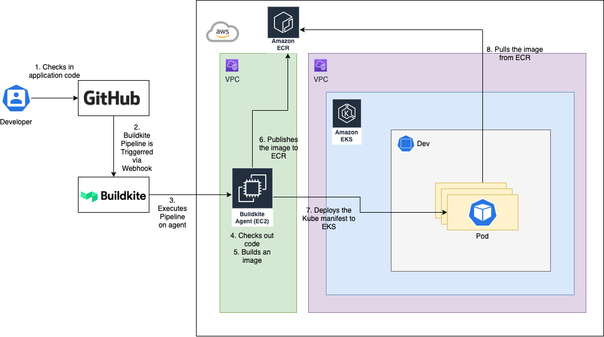
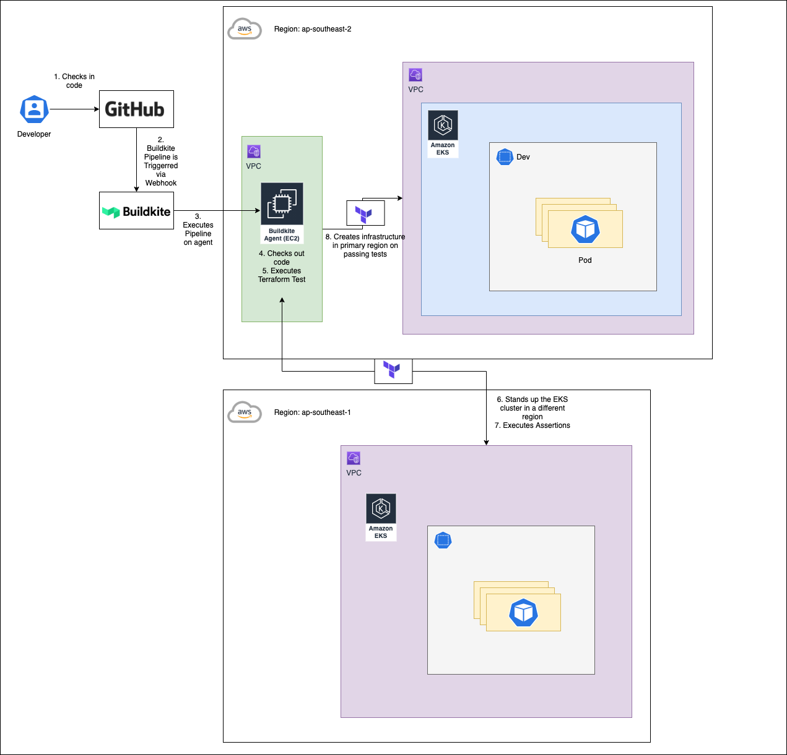
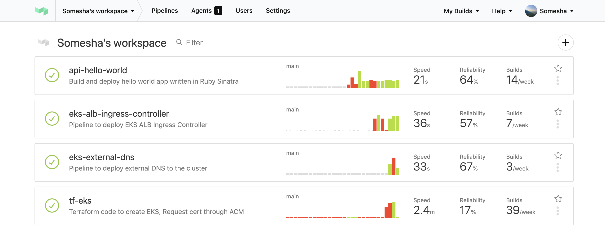
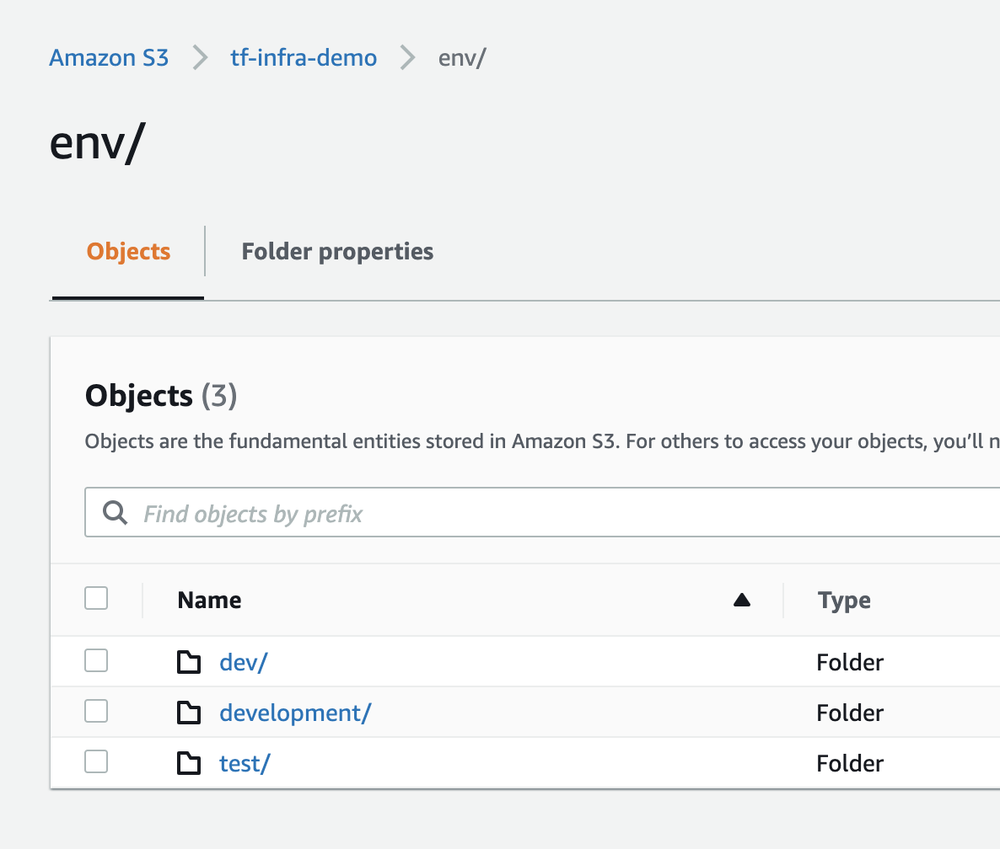
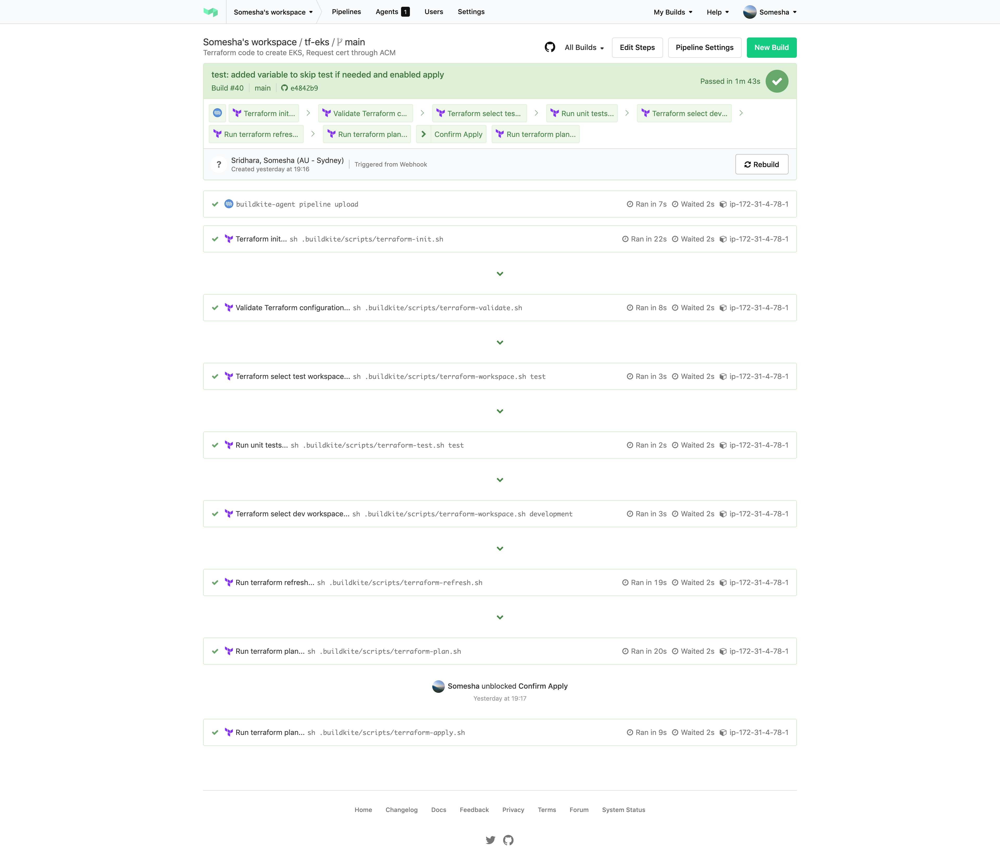

# EKS Platform Sample

This is a reference EKS based platform I created to help standup a Kube platform quickly and deploy a sample dockerized application.

## Approach

I decided to treat this [hello-world](https://github.com/someshsridhara/api-hello-world) application as a public facing API and deployed it to the EKS cluster on AWS.

Demo URL: https://api-hello-world.someshasridhara.com/hello-world

The tools I've used are as below
 - Github for source control (private repositories)
 - Buildkite for CICD
 - Terraform for IaC and standing up the EKS cluster
 - Terratest for testing the Terraform code
 - [ALB Ingress Controller](https://github.com/kubernetes-sigs/aws-load-balancer-controller) for Kubernetes Ingress, deployed with Helm
 - [ExternalDNS](https://github.com/kubernetes-sigs/external-dns), deployed with Helm to the cluster



## Repositories

Links to all repositories for components involved in this setup are below

1. [tf-eks](https://github.com/someshsridhara/tf-eks) - Contains the terraform code used to stand up the infrastructure
2. [eks-alb-ingress-controller](https://github.com/someshsridhara/eks-alb-ingress-controller) - The ALB Ingress Controller deployed to the cluster to handle kube ingress.
3. [eks-external-dns](https://github.com/someshsridhara/eks-external-dns) - Handle external DNS resolution for our custom domain.
4. [api-hello-world](https://github.com/someshsridhara/api-hello-world) - A sample hello world application which will be our test API deployed to the platform.

## CICD

### Application
The image below showcases the CICD workflow for deploying applications.

<sub>CICD Workflow for Application Deployment</sub>

### Infrastructure
The image below illustrates the pipeline for infrastructure deployment.
The tests for IaC (terraform) are run in a different region on the same account.

<sub>CICD Workflow for Infrastructure Deployment</sub>

### Pipelines
Image below of the pipelines on Buildkite I've used to deploy the infrastructure and the application.


## Assumptions
1. I've registered the domain (*.someshasridhara.com) externally and added a hosted zone in route 53 i.e it's not part of the terraform code.
2. The terraform test skips SSL certificate creation step (ingress.tf) in Certificate Manager and the domain validation in Route53. 
3. I have treated the application as being deployed to just one environment (DEV).
4. Infrastructure is being created by a root-like account.

## Other Options
- Deploy the application to Elastic Beanstalk.
- Use [Serverless framework](https://www.serverless.com/) and [serverless-rack](https://www.npmjs.com/package/serverless-rack) plugin for it, expose the endpoint on API Gateway.
- Use Serverless Application Model (SAM) to deploy the app, similar to what's outlined [here](https://github.com/aws-samples/serverless-sinatra-sample).
- Deploy the app to an autoscaling EC2 with an ELB infront secured with SSL from ACM. 

## Steps to deploy

### Terraform

[Buildkite Pipeline](https://buildkite.com/someshas-workspace/tf-eks)

- The terraform code is available in the repository "tf-eks". 
To keep things simple ensure your AWS_PROFILE is set to where you want to deploy or in the terminal session enter the following for the AWS account to where this will be deployed.
```
export AWS_ACCESS_KEY_ID="Your Acccess Key Id"
export AWS_SECRET_ACCESS_KEY="Your Access Key Secret"
```

- **The terraform code uses a domain that I have registered and is added as a Hosted Zone to Route53 on my account, you would need a similar one to test with.
In the file `variables.tf` the var `dns_base_domain` has a default value which will need to be changed to your own domain.**

- In the directory 'tk-eks' run the following

```
terraform init
terraform workspace new dev
```
This should create a new folder in the remote backend (S3 bucket) as shown below and save the state there.


- Run the terraform plan, which should show you the details of what will be created
```
terraform plan -out=dev.tfplan
```

- Run terraform apply
```
terraform apply dev.tfplan
```
This should create the EKS cluster, the VPC it's part of, SSL certificate request for the base domain in ACM and perform certificate validation.

- Alternatively, you also test this which will skip the file `ingress.tf` where the domain and SSL related work happens.
- To run the test, make sure you have Go lang installed.
  Switch to the directory `test` and run the following
 ```
    go test -v tf_eks_unit_test.go copy.go -timeout=60m
``` 
We're giving it a fairly big timeout value as EKS cluster takes forever to provision (18-20m).

The image below shows the steps on the pipeline I created to run this.




### Get KubeConfig
Run the following command to get the Kubeconfig to our new cluster and set that as our current context.
```
aws eks update-kubeconfig --name tf-sample-cluster
```

### Capture the OpenID Connect Issuer details
After terraform has been applied, under IAM -> Identity Providers, there should be an entry with the Provider being a url as below
```
oidc.eks.ap-southeast-2.amazonaws.com/id/ASDASDASDDEA17E738B8C30
```

We would need the last section of the URL `ASDASDASDDEA17E738B8C30` -> This will need to be plugged into the files `trust.json` in the next two deployments

### Ingress Deployment

[Buildkite Pipeline](https://buildkite.com/someshas-workspace/eks-alb-ingress-controller)

- The next step is to deploy our ingress controller which is in the repository called `eks-alb-ingress-controller`
- We can use the buildscripts available in the `.buildkite` folder.

- In the folder, `templates/` find the file named `trust.json` the contents of which should be as below. Enter the last section of the issuer URL we captured earlier (Ex: ASDASDASDDEA17E738B8C30) in the two spots marked <<PLUG HERE>>
```
{
    "Version":"2012-10-17",
    "Statement":[
       {
          "Effect":"Allow",
          "Principal":{
             "Federated":"arn:aws:iam::<<youraccountId>>:oidc-provider/oidc.eks.ap-southeast-2.amazonaws.com/id/<<PLUG HERE>>"
          },
          "Action":"sts:AssumeRoleWithWebIdentity",
          "Condition":{
             "StringEquals":{
                "oidc.eks.ap-southeast-2.amazonaws.com/id/<<PLUG HERE>>:sub":"system:serviceaccount:kube-system:alb-ingress-controller"
             }
          }
       }
    ]
 }
```

- We will need to set the following environment variables
```
  K8S_NAMESPACE="kube-system"
  K8S_CLUSTER_NAME="tf-sample-cluster" -> the cluster name if you changed the default in variables.tf
  SERVICE_ACCOUNT_NAME="alb-ingress-controller"
  POLICY_NAME="AWSLoadBalancerControllerIAMPolicy"
```
Run each of these steps from the root of the project.

- First we'll deploy the RBAC assets for the ingress controller as this EKS cluster is RBAC enabled.
```
.buildkite/scripts/deploy-rbac.sh

 Output:

 clusterrole.rbac.authorization.k8s.io/alb-ingress-controller created
 clusterrolebinding.rbac.authorization.k8s.io/alb-ingress-controller created
 serviceaccount/alb-ingress-controller created
```

- Second we create the role that our ingress controller's service account will be annotated with so it can spin up an ALB for our applications.
Once they're set we run
```
.buildkite/scripts/deploy-service-account.sh

 Output:

 Getting policies available to check if the policy being created already exists..
 Creating policy as it doesnt exist..
 arn:aws:iam::***:policy/AWSLoadBalancerControllerIAMPolicy
 Creating IAM role..
 Attaching policy..
 Annotating the ingress controller service account
 serviceaccount/alb-ingress-controller annotated
``` 

- The last step is to deploy the ingress controller's manifests
```
.buildkite/scripts/deploy-ingress-controller.sh
```

### External-DNS Deployment

[Buildkite Pipeline](https://buildkite.com/someshas-workspace/eks-external-dns)

To be able to resolve the TLS endpoints the ALB ingress controller creates on an ALB with our custom domain, we'll need external DNS to control DNS records dynamically.

- In the repository titled `eks-external-dns` go to the folder, `templates/` find the file named `trust.json` the contents of which should be as below. Enter the last section of the issuer URL we captured earlier (Ex: ASDASDASDDEA17E738B8C30) in the two spots marked <<PLUG HERE>>
```
{
    "Version":"2012-10-17",
    "Statement":[
       {
          "Effect":"Allow",
          "Principal":{
             "Federated":"arn:aws:iam::<<youraccountId>>:oidc-provider/oidc.eks.ap-southeast-2.amazonaws.com/id/<<PLUG HERE>>"
          },
          "Action":"sts:AssumeRoleWithWebIdentity",
          "Condition":{
             "StringEquals":{
                "oidc.eks.ap-southeast-2.amazonaws.com/id/<<PLUG HERE>>:sub":"system:serviceaccount:kube-system:alb-ingress-controller"
             }
          }
       }
    ]
 }
```
- We will need to set the following environment variables
```
  POLICY_NAME="ExternalDNSServiceAccountPolicy"
```
- Now we can run the script to deploy this to our cluster
```
.buildkite/scripts/deploy.sh

 Output:

 Getting policies available to check if the policy being created already exists..
 Creating policy as it doesnt exist..
 arn:aws:iam::****:policy/ExternalDNSServiceAccountPolicy
 Creating and Annotating the ingress controller service account
 serviceaccount/external-dns created
 serviceaccount/external-dns annotated
 Deploy External-DNS
 clusterrole.rbac.authorization.k8s.io/external-dns created
 clusterrolebinding.rbac.authorization.k8s.io/external-dns-viewer created
 deployment.apps/external-dns created
 deployment.apps/external-dns annotated
```

### api-hello-world Deployment

[Buildkite Pipeline](https://buildkite.com/someshas-workspace/api-hello-world)

This is the last step to deploy the sample Ruby Sinatra application.

Running the deployment scripts locally will publish and image to ECR and the EKS cluster will pull it from ECR.

- We will need to set the following environment variables
```
  APP_IMAGE_NAME="api-hello-world"
  BASE_DOMAIN="<<yourdomain.com>>" -------------> The base domain you used in terraform.
  IMAGE_REGISTRY="<<youraccountId>>.dkr.ecr.ap-southeast-2.amazonaws.com"
  K8S_CLUSTER_NAME=tf-sample-cluster
  AWS_REGION=ap-southeast-2
  K8S_CLUSTER_REGION=ap-southeast-2
  K8S_DEV_NAMESPACE="dev"
  K8S_DEPLOYMENT_FILE="kube/k8s-resources.yaml"
```

- Run the command below to build the image for the application and push it to ECR.
```
.buildkite/scripts/build.sh
```

- Deploy the application by running the following
```
.buildkite/scripts/deploy.sh

 Output:

 2021-01-18 10:06:01 WARN   No meta-data value exists with key `release-version`, returning the supplied  default "fd620ea"
 674605608543.dkr.ecr.ap-southeast-2.amazonaws.com/api-hello-world:fd620ea will be deployed..
 Substituting env variables in the kube manifest
 W0118 10:06:01.948000   41938 helpers.go:553] --dry-run is deprecated and can be replaced with --dry-run  =client.
 namespace/dev configured
 deployment.apps/api-hello-world configured
 service/api-hello-world unchanged
 ingress.extensions/api-hello-world configured
```

### Test
Wait till the ALB is provisioned after the deployment, should take about 5-7 mins. Then visit the following url
```
https://api-hello-world.yourdomain.com/hello-world
```

## Improvements
In this section I'll outline some of the things I'd do if I could spend more time with this.

On the platform:
1. I would deploy an API gateway possibly Kong to front the public traffic and forward to the Kube ingress. This would allow us to set policies (Throttling, Rate-limiting, Authentication)
2. Deploy Vault to handle secrets.
3. Deploy Istio for Kube ingress (Kong -> Istio Ingress Gateway), advanced routing controls and for observability (Kiali, Jaeger, Prometheus and Grafana are bundled with Istio now).
4. Deploy cluster auto scaler. 
5. Possibly split the CI and CD. Use Buildkite to just build but handle the deployment in a GitOps style possibly with ArgoCD/Flux, this will help avoid any config-drift between actual (environment) vs what's expected.
6. Automate the process of getting the OIDC issuer details to plug into the `trust.json` attached to the roles for the ingress and external-dns.

Other improvements:
1. Structure my terraform code better, modularize things especially around EKS creation instead of using the AWS eks_cluster module, write a custom one as this module has problems destroying security groups some times.
2. Use Ansible for deploying ALB Ingress, External-DNS instead of using BASH scripts and use Molecule to test Ansible scripts.
3. Add some unit test to the sample application and run unit tests in the deployment pipeline.
4. Run code quality scanning (Sonarqube/Sonarcloud), code vulnerability scans (Snyk,Checkmarx) and image vulnerability scanning (Anchore OSS/Enterprise) in the pipeline.


## Productionizing this

To make this platform production ready, apart from the platform level improvements I mentioned in the previous section I would add below

- Create separate accounts for test, non-prod, prod, shared-services where

|Account| Purpose |
|-------|--|
|Test       | Run infrastructure and config tests (terratest, molecule) |
|shared-services       |Deploy an EKS cluster to contain build agents, nexus/artifactory, Anchore |
|Prod       | Deploy production Cluster |
|Non-prod       | Deploy non-prod Cluster with namespaces for non-prod environments (dev, sit, uat)|

- Use AWS role switching/assume roles for CICD to deploy to the non-prod / prod account assuming cicd agents will run in the `shared-services` account

- Have a good API design and naming strategy.    
```
 Dev and non-prod: 
 https://api-{env}.example.com/{version}/{resource}
 Ex: https://api-dev.example.com/v1/hello-world

 Prod:
 https://api.example.com/{version}/{resource}
  Ex: https://api.example.com/v1/hello-world
 ```

- Have an approach to do canary/blue-green releases. Istio can do weighted traffic routing.

- Include log shipping to ELK, Splunk or Sumologic with fluentd/collectors deployed to the shared-services cluster.

- I would look at deploying a developer portal that houses the API specifications and is tied into the CICD process so it always has the specs being used in the environment. 
